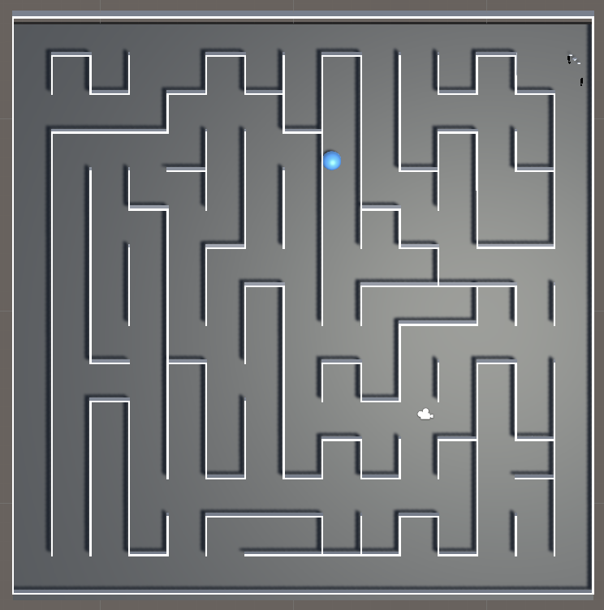

# Footstep-RL

##### The project is about:

---

The code files I have written are in the folder **FootstepAgents**:

The important code files are in the **FootstepAgents/Assets/Script** folder.

Have a peek at [Folder Structure](./README-folder_structure.md).

This project implements the academic paper, [Footstep-navigation-for-dynamic-crowds](./Footstep-navigation-for-dynamic-crowds.pdf).

### Validate the implementation

#### Open the project

To open the project, clone the repository and open it with Unity Hub. In Unity Hub, navigate to the repository folder, click "open" in the `FootstepAgents/ folder. Make sure that Editor Version corresponding to the project is set to <u>2019.4.29f1</u>.

With these settings correctly, and after Unity does the heavy lifting, the project will open.

#### Run the project

Simply click the Play button  at the middle of the top.

A maze will appear and the footstep agent appears at the top right of the maze. It walks and resets when hits with any wall of the maze.

#### Features

There are some interesting and successful RL trainings that I have done with this implementation.

##### Agent's Architecture

##### Using of ML-Agent

##### Field of View

##### Maze Construction

##### Walk towards the goal.

##### Walk around the wall

